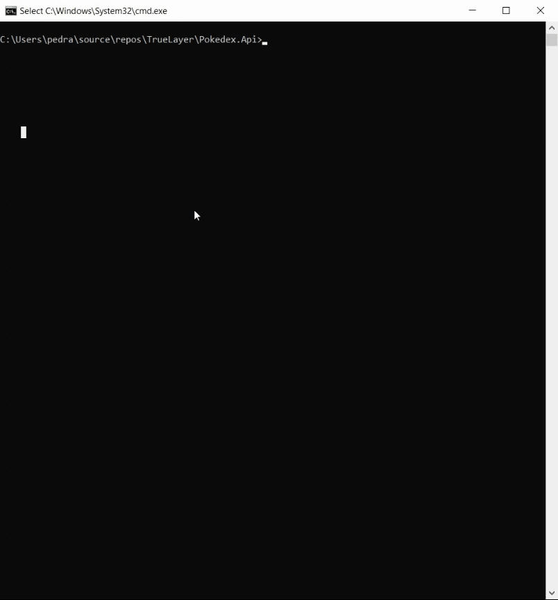
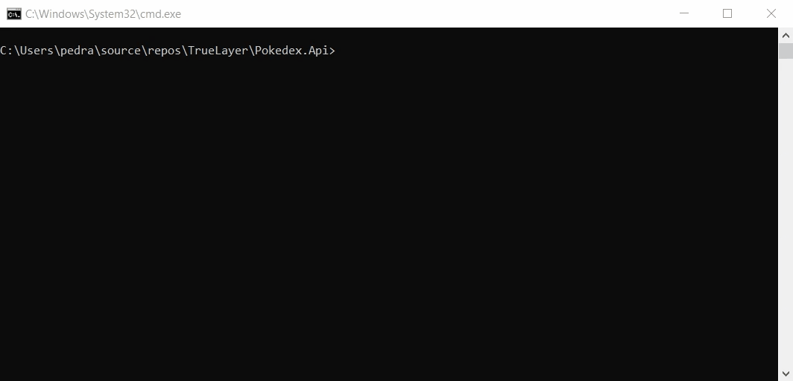

# TrueLayer Test, Pokedex
A simple Pokemon Rest API using .Net 5 for TrueLayer.

## Prerequistes
- .NET 5 https://dotnet.microsoft.com/download/dotnet/5.0

## Third Parties
- .NLog 4.7.10
- Newtonsoft.Json 13.0.1
- Swagger 6.1.14
- XUnit 2.4.1
- Moq 4.16.1

## Running Pokedex
Clone the project. Open the command prompt (in windows) an run the command "dotnet run" in this path: \TrueLayer\Pokedex.Api

After runnin the app the api will host on two differents port:
https://localhost:5001 ,
http://localhost:5000

  

You can also browse this link to discover the API: https://localhost:5001/Swagger

 

## About APIs
This rest API consist of two Get APIs:
All APIs return json. Response contains result, success, and errors:
- Success is a boolan field and indicate that the request is succesful or not. (If the success is true, result has value and otherwise errors has value)
- Result consist of the return values of the API.
- Errors which is a list of object, consist of message and type. Message is the description of error and type is a unique number for type of errors.

- The first one receive a Pokemon name, returns standard Pokemon description and additional information.
   Example EndPoint:    
  /HTTP/GET  /pokemon/<pokemon name>
  
The result field has 4 field:
  - Pokemon's Name  (string)
  - Pokemon's standard description  (string)
  - Pokemon's habitat  (string)
  - Pokemon's status  (a boolean shows that is the pokemon legandary or not)

- The second one receive a Pokemon name, return translated Pokemon description and other basic information.
   Example EndPoint:
   /HTTP/GET  /pokemon/translated/<pokemon name>
   
 The result field has 4 field:
  - Pokemon's Name  (string)
  - Pokemon's standard description  (string)
  - Pokemon's habitat  (string)
  - Pokemon's status  (a boolean shows that is the pokemon legandary or not)
   
## Running Unit Tests
 You can go to the test explorer window in Visual Studio and push the run button, or run the command "dotnet test" in this path: \TrueLayer\Pokedex.UnitTest
   
   
   
