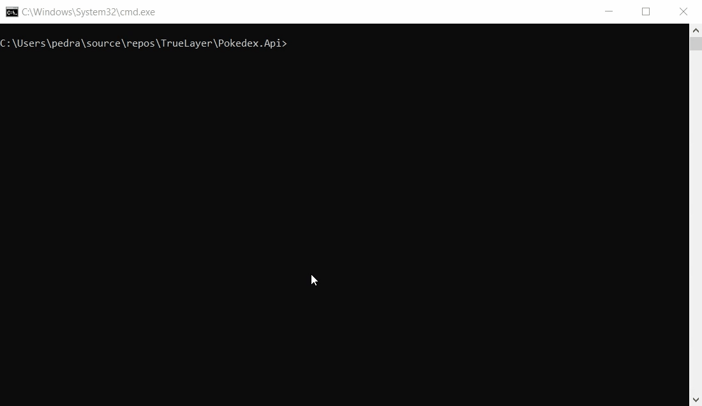

# TrueLayer Test, Pokedex
A simple Pokemon Rest API using .Net 5 for TrueLayer.

## Prerequisites
- .NET 5 https://dotnet.microsoft.com/download/dotnet/5.0

## Nuget Packages
- .NLog 4.7.10
- Newtonsoft.Json 13.0.1
- Swagger 6.1.14
- XUnit 2.4.1
- Moq 4.16.1

## Third Parties

This Project has used these public APIs:
- https://funtranslations.com/api/shakespeare
- https://pokeapi.co/api/v2

## Running Pokedex
Clone the project. Open the command prompt (in windows) and run the command "dotnet run" in this path: \TrueLayer\Pokedex.Api

After running the app, the API will host on two different ports:
https://localhost:5001 ,
http://localhost:5000

  

You can also browse this link to discover the API: https://localhost:5001/Swagger

 

## About APIs
This rest API consists of two Get APIs. This project support API versioning. (The current version is v1)
All APIs return Json format. The response contains result, success, and errors:
- Success is a boolean field and indicates the request is successful or not. (If the success is true, the result has value, otherwise errors has value)
- Result consists of the return values of the API.
- Errors which is a list of objects, consist of message and type. Message is the description of error and type is a unique number for the type of errors.

### The first one receives a Pokemon name, returns a standard Pokemon description and additional information.
   Example EndPoint:    
  /HTTP/GET  api/v1/pokemon/<pokemon name>
  
The result field has 4 fields:
  - Pokemon's Name  (string)
  - Pokemon's standard description  (string)
  - Pokemon's habitat  (string)
  - Pokemon's status  (a boolean shows that whether the pokemon is legendary or not)

### The second one receives a Pokemon name, returns translated Pokemon description and other basic information.
   Example EndPoint:
   /HTTP/GET  api/v1/pokemon/translated/<pokemon name>
   
 The result field has 4 fields:
  - Pokemon's Name  (string)
  - Translated Pokemon's description  (string)
  - Pokemon's habitat  (string)
  - Pokemon's status  (a boolean shows that whether the pokemon is legendary or not)
   
## Running Unit Tests
 You can go to the test explorer window in Visual Studio and push the run button, or run the command "dotnet test" in this path: \TrueLayer\Pokedex.UnitTest
   
   
  
## CI/CD
  I added an Action to the Github repository for building and running the unit tests every time the code is pushed to the repository. If all the checks (building and running tests) are passed, PR can be merged to the main branch.
  
## Docker
  The project also contains a simple docker file for dockerizing the API.

## Future Suggestion
  - Add caching for calling the third party APIs.
   
